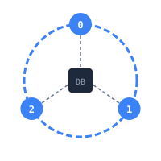

<div align="center">



# @hieujojo/distributed-cache

**Lightweight distributed cache built from scratch in TypeScript**

Consistent hashing, replication, eviction strategies (LRU/LFU/FIFO), TTL, cluster management, and TCP protocol — the same patterns used in **Redis**, **DynamoDB**, and **Cassandra**.

<br>

[](https://www.npmjs.com/package/@hieujojo/distributed-cache)
[](https://opensource.org/licenses/MIT)
[](https://github.com/hieujojo/distributed-cache/actions)
[](https://nodejs.org)
[](https://www.typescriptlang.org/)

<br>

[**Documentation**](https://distributed-cache-docs.vercel.app/) · [**Getting Started**](https://distributed-cache-docs.vercel.app/guide/quickstart.html) · [**API Reference**](https://distributed-cache-docs.vercel.app/api/cache-node.html) · [**Tài liệu (VI)**](https://distributed-cache-docs.vercel.app/vi/)

</div>

---

## Quick Start

```bash
npm install @hieujojo/distributed-cache
```

```typescript
import { CacheNode, ConsistentHash } from "@hieujojo/distributed-cache";

// Create nodes
const node1 = new CacheNode("node-1", { maxSize: 10000 });
const node2 = new CacheNode("node-2", { maxSize: 10000 });
const node3 = new CacheNode("node-3", { maxSize: 10000 });

// Setup hash ring
const hash = new ConsistentHash();
hash.addNode(node1);
hash.addNode(node2);
hash.addNode(node3);

// Store & retrieve — automatically routes to correct node
const node = hash.getNode("user:123");
node?.set("user:123", { name: "John" });
console.log(node?.get("user:123")); // { name: "John" }
```

## Features

- **Consistent Hashing** — Hash ring with virtual nodes for even data distribution
- **Eviction Strategies** — LRU, LFU, FIFO with automatic cleanup
- **TTL** — Auto-expire entries after a set time
- **Replication** — Quorum-based data replication across nodes
- **Cache Invalidation** — Wildcard-based cleanup when source data changes
- **Cluster Management** — Leader election + automatic failover
- **TCP Protocol** — Low-latency wire protocol (Redis-inspired)
- **Medusa.js Integration** — Ready-to-use adapter for e-commerce

## Performance

| Operation | Throughput | Avg Latency |
|---|---|---|
| GET | 120,000+ ops/sec | 0.008ms |
| SET | 131,000+ ops/sec | 0.008ms |
| Mixed (80/20) | 119,000+ ops/sec | 0.008ms |

> Benchmarked with 5000 operations, 1000 keys, 3 nodes on a single machine.

## Documentation

Visit **[distributed-cache-docs.vercel.app](https://distributed-cache-docs.vercel.app/)** for full documentation.

- [Introduction](https://distributed-cache-docs.vercel.app/guide/)
- [Architecture](https://distributed-cache-docs.vercel.app/guide/architecture.html)
- [Consistent Hashing](https://distributed-cache-docs.vercel.app/guide/consistent-hashing.html)
- [Eviction Strategies](https://distributed-cache-docs.vercel.app/guide/eviction.html)
- [TCP Protocol](https://distributed-cache-docs.vercel.app/guide/protocol.html)
- [Benchmark Results](https://distributed-cache-docs.vercel.app/guide/benchmark.html)

## Contributing

Contributions are welcome! Please read our [Contributing Guide](CONTRIBUTING.md) first.

```bash
git clone https://github.com/hieujojo/distributed-cache.git
cd distributed-cache
npm install
npm test
```

## Security

If you discover a security vulnerability, please [report it responsibly](SECURITY.md). **Do NOT** open a public issue.

## License

[MIT](LICENSE) © [Truong Cong Hieu](https://github.com/hieujojo)
